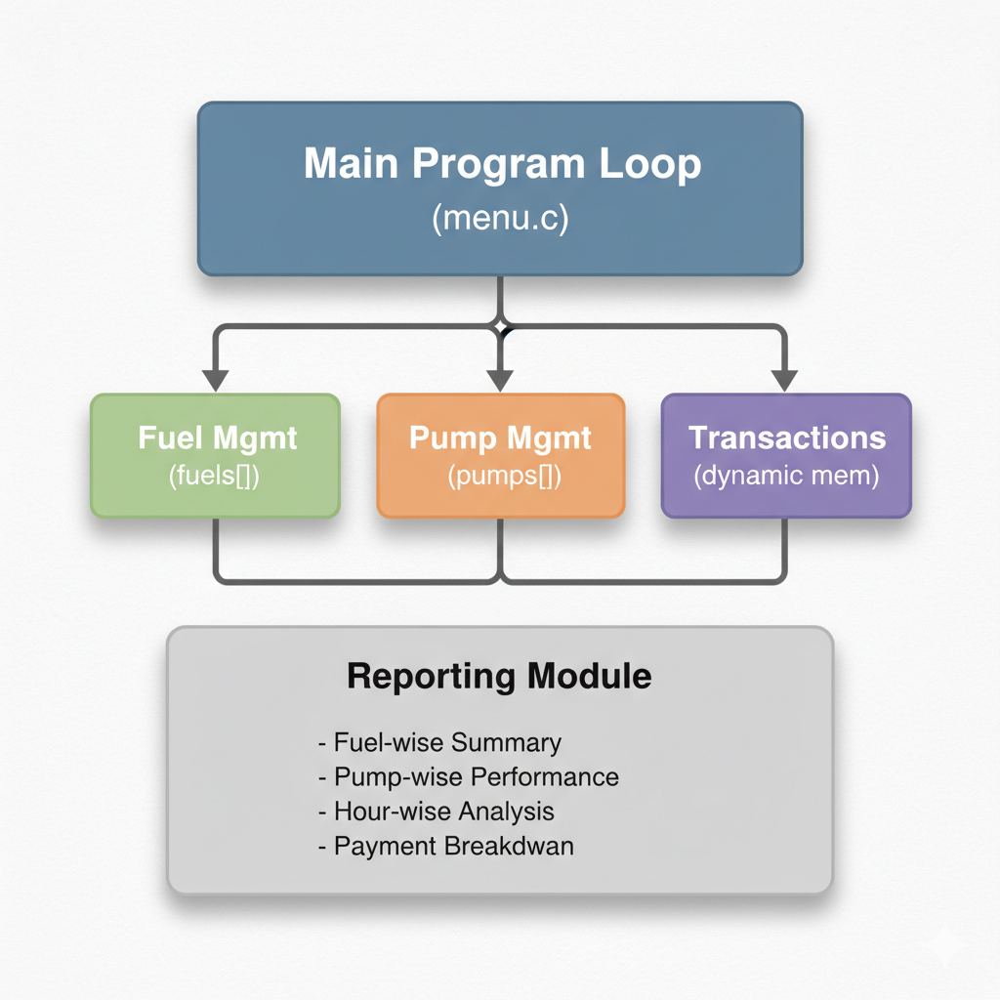

# ⛽ Petrol Pump Management System (C)

A comprehensive terminal-based Petrol Pump Management System built in C, designed to simulate real-world petrol pump operations including fuel inventory management, pump control, transaction handling, and revenue reporting — all powered by dynamic memory allocation and modular design.

⸻

## 🧭 Table of Contents
	•	Overview
	•	Key Features
	•	System Architecture
	•	Tech Stack
	•	Compilation & Execution
	•	Menu Options
	•	Data Structures Used
	•	Dynamic Memory Management
	•	Sample Output
	•	Future Enhancements
	•	License

⸻

## 🧩 Overview

The Petrol Pump Management System provides an efficient way to manage a fuel station’s daily operations.
It supports real-time inventory tracking, multiple pumps, different fuel types, and dynamic transaction logging using calloc and realloc.

This project demonstrates:
	•	Modular programming with structures
	•	Efficient use of pointers
	•	Static variables for persistent tracking
	•	Clean memory management in C

⸻

## 🚀 Key Features

✅ Fuel Inventory Management
	•	Tracks Petrol, Diesel, and CNG stock levels dynamically
	•	Automatic low stock alerts

✅ Multi-Pump Operation
	•	6 pumps: 2 Petrol, 2 Diesel, 2 CNG
	•	Change pump status (Active / Inactive / Maintenance)

✅ Sales Transactions
	•	Unique Transaction ID generation
	•	Supports 3 vehicle types (2W, 4W, Commercial)
	•	Supports 3 payment modes (Cash, Card, Digital Wallet)
	•	Quantity or amount-based input modes

✅ Reports & Analytics
	•	Daily sales report
	•	Pump-wise, fuel-wise, and hour-wise analysis
	•	Payment-mode-wise revenue breakdown

✅ Memory Management
	•	Dynamic transaction storage using calloc and realloc
	•	Safe resizing and deallocation at shutdown

⸻

## 🏗️ System Architecture

## 🧰 Tech Stack

	•	Language: C
	•	Compiler: Clang (Apple Clang / LLVM)
	•	IDE / Editor: Visual Studio Code
	•	Version Control: Git & GitHub
	•	Operating System: macOS (Compatible with Linux & Windows)
	•	Build Tools: Command Line (Terminal) / VS Code Build Tasks
	•	Memory Management: Dynamic allocation using malloc(), calloc(), realloc(), and free()
	•	Dependencies: Standard C Libraries
	•	stdio.h — Input/Output
	•	stdlib.h — Memory Allocation, Conversions
	•	string.h — String Manipulation
	•	ctype.h — Character Handling

## 💾 Dynamic Memory Management
	•	Transactions stored in a dynamic array
	•	Initially allocated with calloc(INITIAL_TX_CAPACITY, sizeof(Transaction))
	•	Automatically expanded using realloc() as more sales occur
	•	Freed at shutdown using free()

Benefits:
	•	Efficient memory usage (no large static arrays)
	•	Scalable as number of transactions grows
	•	Clean lifecycle management

⸻

## 🧾 Sample Output (Receipt)
------------------- FUEL RECEIPT -------------------
Transaction ID : TXN20251102120000001
Date & Time    : 2025-11-02 12:00:45
Pump ID        : 3
Fuel Type      : Diesel
Vehicle Type   : 4-Wheeler
Quantity       : 25.000 liters
Amount (INR)   : 2218.75
Payment Mode   : Credit Card
----------------------------------------------------

## 🔮 Future Enhancements
	•	File I/O for persistent transaction logging
	•	Admin authentication system
	•	Monthly and yearly reports
	•	GUI version (C/GTK or web dashboard)
	•	Integration with real-time fuel price APIs

## 📜 License

This project is released under the MIT License.
You are free to use, modify, and distribute with attribution.

## 💡 Author

👨‍💻 Sufiyan Yusuf
B.Tech CSE (Artificial Intelligence and Machine Learning)
📍 India 

If you like this project, ⭐ star the repository and share it!

